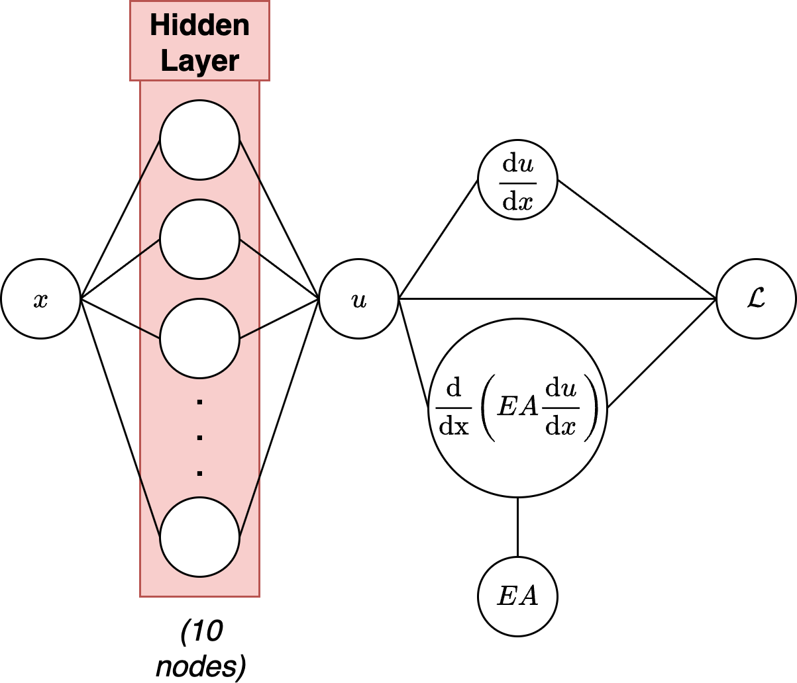
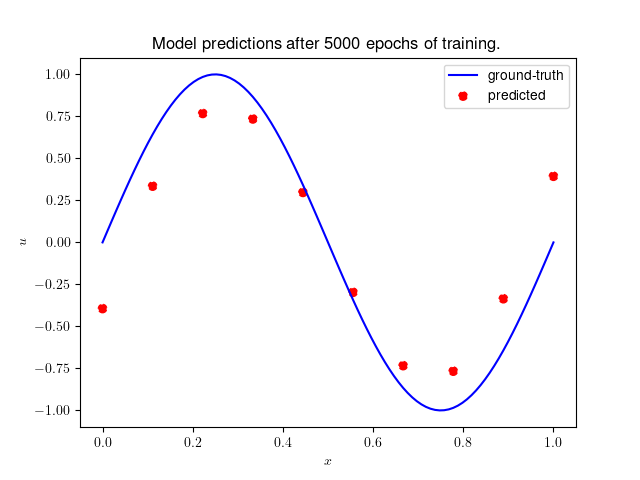
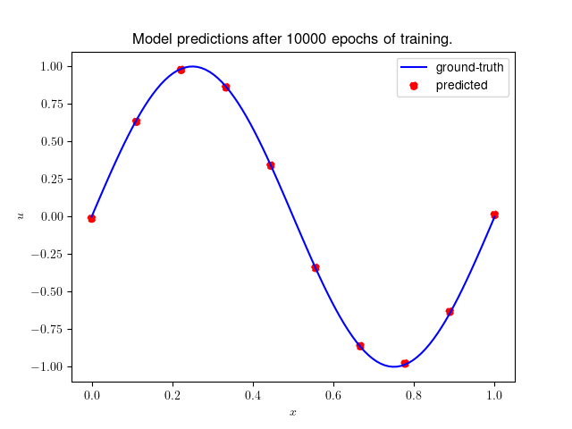

# Physics-Informed Neural Network (PINN) for Solving Elastic Bar DE

This repo is based on the work of [Kollmansberger et al.](https://link.springer.com/book/10.1007/978-3-030-76587-3), pages 60-63, where they attempt to solve the following equation: 

$f = \frac{\text{d}}{\text{d}x} \left(EA\frac{\text{d}u}{\text{d}x}\right) + p = 0$

subject to the Dirichlet boundary conditions 

$u(x=0) = u(x=1) = 0$

where $u$ is displacement of the bar. We use a trial solution of the form 

$u(x) = \text{sin}(2 \pi x)$ which implies an inhomogeneous term of the form $p = 4\pi^2 \text{sin}(2 \pi x)$

and a loss function 

$J = \frac{1}{N_b} \sum_{i=1}^{N_b} \left| u_{NN}(x_b^i; \theta) - u(x_b^i)\right|^2 + \frac{1}{N_f} \sum_{i=1}^{N_f} \left| f(x_f^i) \right|^2$ 

where the two terms encode the boundary conditions' residual and the $\text{PDE}$ residual, respectively. Note that we are stuck in the *static* case where we have no explicit time dependence, and only one dependent variable, $x$.

Note that most of the code implementation is original, though I have borrowed some steps (as appropriate) from the original Kollmansberger book (referenced above).

## What's the Point of PINNs?
Physics-informed neural networks are useful for enforcing a certain *type* of solution onto the neural network. *A priori*, the neural network has no knowledge of the important physics at play- for example, it won't really have any good reason to enforce *causality* if it isn't told to do so. Which can be a huge problem if you're actually trying to do physics problems.

The second term in the objective function above, the $\text{PDE}$ residual, can be seen as an additional regularisation condition on the neural network's training which enforces restrictions on the solution space for the problem, i.e. the number of ways the network can turn out. Therefore, there is evidence that introducting physics-informed loss functions can actually **reduce the required size of the data set**[^2] for good performance. Which is great in physics experiments, where data appears (typically) in the dozens (or less!) rather than the thousands or millions of modern ML training sets[^1].

## The PINN
The architecture of the neural network which was constructed for this project is shown below.

<figure>

<figcaption>Architecture of the multi-layer perceptron (MLP) used in the model.</figcaption>
</figure>

and we use this to plot the predicted value of $u$ as a function of $x$. After a moderate (!) number of epochs, we have the following agreement between the model and the analytical solution:

<figure>

<figcaption>Model predictions against ground truth values for solution after 5000 epochs of training.</figcaption>
</figure>

<figure>

<figcaption>Model predictions against ground truth values for solution after 10000 epochs of training.</figcaption>
</figure>

[^1]: See, for example, ImageNet, ImageNet-21k, JFT-300M, CIFAR-10/100... All of which dwarf the amount of data available from most physics experiments (trust me; I've worked on some).

[^2]: See, of course, the [amazing paper](https://www.sciencedirect.com/science/article/abs/pii/S0021999118307125): Raissi, M., Perdikaris, P., & Karniadakis, G. E. (2019). Physics-informed neural networks: A deep learning framework for solving forward and inverse problems involving nonlinear partial differential equations. Journal of Computational Physics, 378, 686–707. https://doi.org/10.1016/j.jcp.2018.10.045